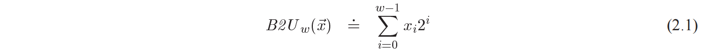
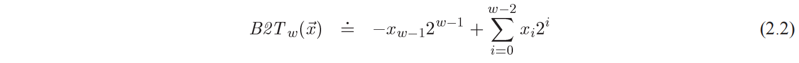
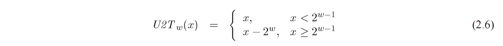
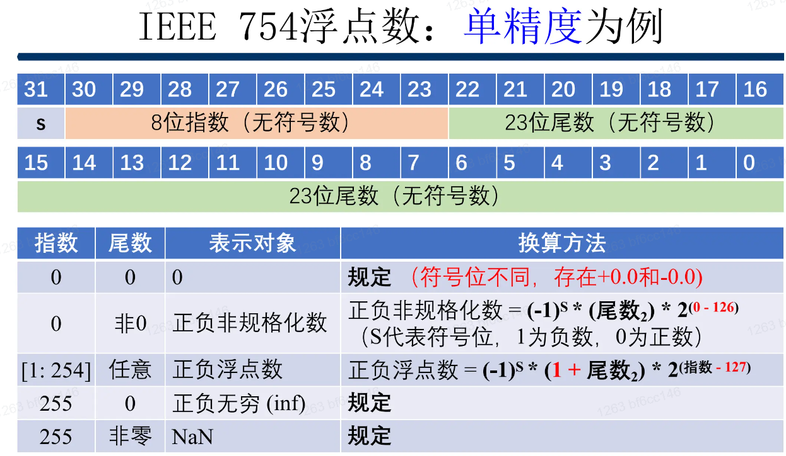
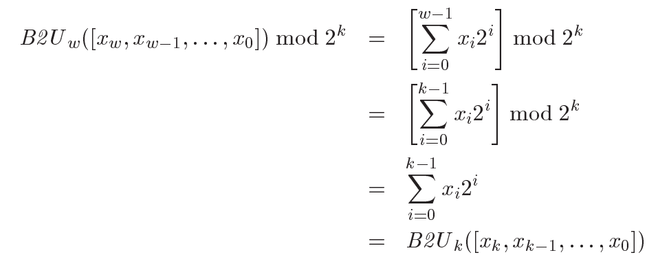

### 2.1 整数表示
B 代表 Binary 表示
U 代表 Unsigned 编码解释位向量
T 代表 Two's Complemet 补码编码解释位向量
w 代表位数
x 为位数向量（由低位从 0 开始）

__无符号数编码__

__补码编码__

即补码的符号位代表负值 -2^(w-1) 又由符号位为最高位 so 一定为负数，同时解释了`B2T([1000]) = -8 + 0 = -8`，也可以理解可以如此计算补码：符号位 0+ 1-,非符号位数取反后加 1.因为全 1 的数 x 减去某二进制数 y = x^y.而实际上为 -2^(w-1)，故还需要加上负一，即最后的 1 
__无符号数编码转补码编码（位向量不变）__

对于超出 Tmax 的部分 (> 2^(w-1)) 则是直接 -2 * 2^(w-1) 即 -2^w.
#### 2.1.2 有符号拓展的理解
ps: 这样的理解简直是折磨自己...不如书上的
> 用例子来说明，__short__ 类型的 -12345，大端模式下为 cf c7
可以理解为 -2^15 + 0x4fc7，现在将其拓展为 __int__ 则为 ff ff cf c7 将该数拆分为符号位和数据位，先考虑 0xff ff ff ff，其值为 __-1__，可以表示为 __-2^31 + 0x7f ff ff ff__，现在将它与 __0x7f ff cf c7 - 2^31__ 比较，即多加了 __0xffff - 0xcfc7__ ,而上个式子可以表示为 __- (0xcfc7 - 2^15 + 1)__.即 __(0x7f ff ff ff - 2^31) - (0xffff - 0xcfc7) = (0x7f ff cf c7 - 2^31)__ 
所以拓展后的结果即为 __-1 + (0xcfc7 - 2^15 + 1)__ 即为 __0xcfc7 - 2^15__ 与 __short__ 类型表示数值相同。

书上数学归纳法严格证明 p55

```c
// C 语言标准要求
short sx = -12345;
(unsigned)sx // 等价于 (unsigned) (int) sx，即先有符号拓展，再改变解释形式
```
### 2.2 浮点数表示
$$
b = \sum_{i=-n}^m 2^i \times b_i
$$
其中 $n$ 表示在小数点后的位数，$m$ 表示在小数点前位数 -1.(因为最高位权重为 $2^m$ )
#### 浮点数舍入
采用向偶舍入的方式，（对于十进制）四舍六入五取偶，注意必须要是在一个数的正中间才能取偶，其他则不行。（对于二进制）如 $10.00110_2(2\frac{3}{16})$，将其舍入到小数点后第二位为$10.01_2(2\frac{1}{4})$，
> eg. -0.1-> 0xbdcccccd
#### IEEE 754
$$
V = (-1)^s \times M \times 2^E
$$
其中，s 为符号位，E 为 k 位阶码，M 为 n 位尾数
单精度浮点数中，k=8,n=23.
##### 规格化数
* 阶码的值 $E = e - Bias$，其中 $e=e_{k-1}...e_1e_0$，$Bias = 2^{k-1}-1$
* 尾数的值为 $M = 1 + f$，其中 f 看为 $0.f_{n-1}f_{n-2}...f_1f_0$（是由于有前导 1）
##### 非规格化数
* 阶码的值 $E = 1 - Bias$
* 尾数的值 $M = f$，不含前导 1（使得能表示 0）

对于阶码取 1-Bias 的原因：见书 **p81**



### 2.3 注：强制转换
__截断无符号数的数学表示__

__截断有符号数的数学表示__
这里的数学不是很美好了。。。
理解为先转换为无符号数，再由无符号数转变为有符号的
#### 2.3.1 整数
对于等长，无符号与有符号间 => 实际的字节位不变，只是改变解释位的方式。(B/T)