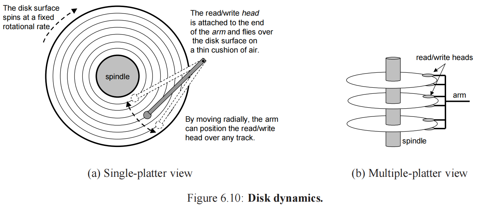

### 6.1.1 随机访问存储器
1. **静态 RAM SRAM**
快，贵，抗干扰（每位 6 晶体管电路）。
2. **动态 RAM DRAM**
慢，便宜，干扰敏感（电容电压易改变，每位 1 晶体管电路）
#### ROM Read Only Memory（非易失性存储器）
__PROM__ Programmable ROM，只能被编程一次
__EPROM__ Erasable PROM 可擦写可编程 ROM-> 通过紫外光照射擦除 (擦除数量级 1k)
__EEPROM__ Electrically EPROM 电子可擦写可编程 ROM (擦除数量级 10^5)
__Flash__ 闪存，基于 __EEPROM__，而基于闪存的磁盘驱动器 固态硬盘 __SSD(solid state disk)__
存储在 ROM 设备中程序被称为 FirmWare 固件
### 6.1.2 磁盘存储

### 6.4.1 通用高速缓存存储器组织结构
$t+s+b=m，其中\;m\;为每个寄存器地址位，（注意是主存物理地址）$

$[t_{标记位}\mid s_{组索引位}\mid b_{块偏移位}]$

每个高速缓存块字节数为 B
每组高速缓存行数 E (E 的意思为：当内存中多个内存块都映射到了同一个组中，该组最多可以放多少个内存块，其中各个内存块在组内任意排布)
高速缓存容量 C：
$C=B\times E \times S$
且有$B=2^b,S=2^s$

**高速缓存确定请求命中**
1. 组选择，根据组索引位找到相应组
2. 行匹配，将各个行的标记位与 CPU 取址的标记位匹配
3. 字选择，
